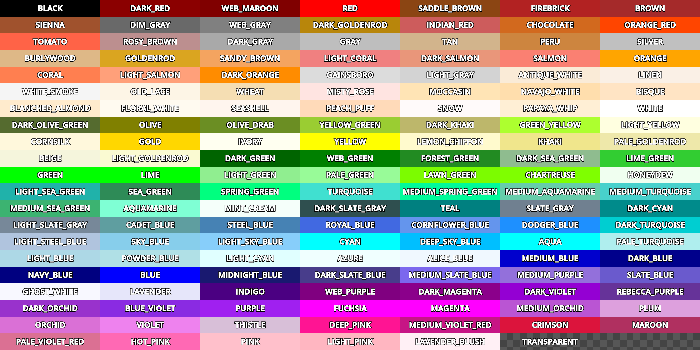

# godolors :art:
Generates a preview of Godot color constants

https://docs.godotengine.org/en/stable/classes/class_color.html

## Usage

Run the Godot project

Old version built with Godot 3 is available in the `godot-3` branch.

## Update colors

*Last updated 2023-11-30 for Godot 4.2*

Update `_INPUT_COLORS_HERE.txt` with the colors from the Godot Documentation: https://docs.godotengine.org/en/stable/classes/class_color.html
